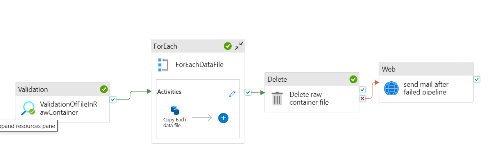
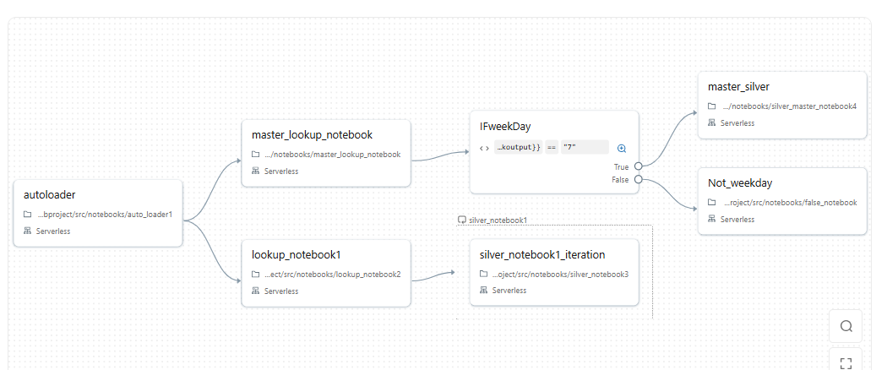
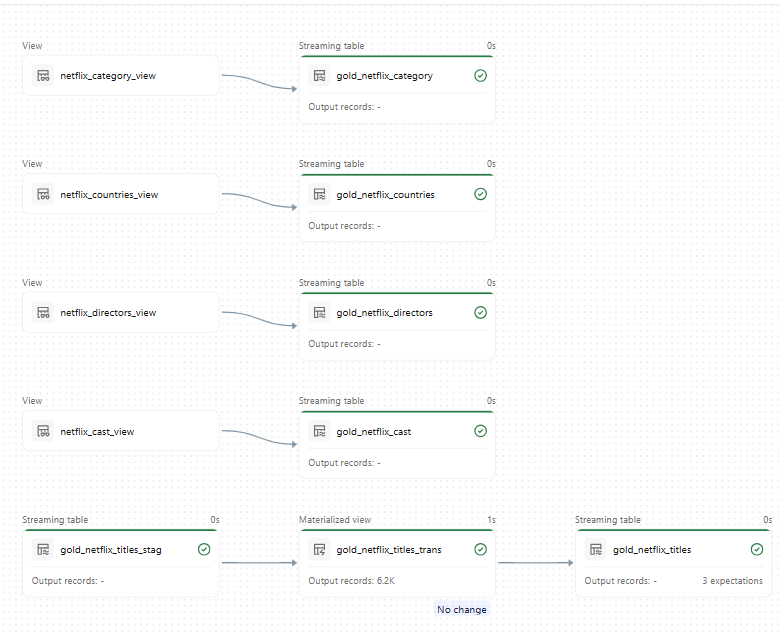

# azure_end_to_end_netflix_dlt_assetBundle_project
project Discription ADF pipeline:
  Developed a dynamic ingestion pipeline to load data from GitHub to ADLS, with automated file validation to trigger processing only when new files are available in the raw container.
  Architecture of ADF pipeline is:
      

databricks Job:
      

DLT pipeline for gold layer
      

